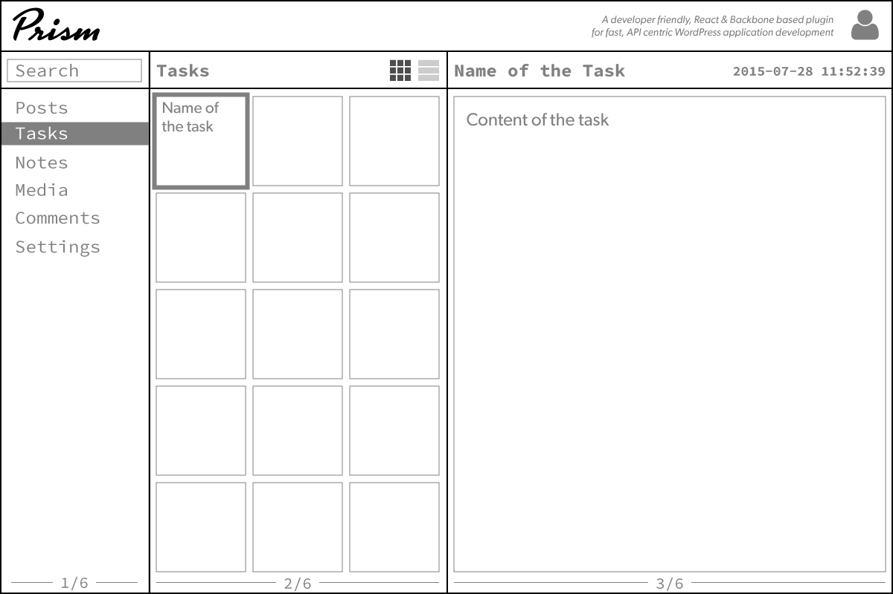

Prism is a developer friendly, React & Backbone based theme for fast, API centric WordPress application development

Actually, it's a plugin to start. Actually actually, it will probably never be a theme.

WordPress is a super flexible way of holding all your stuff.

We need a super flexible way for viewing and manipulating all your stuff.

That's the name, Prism. It's a fast way of viewing the data in your application.

# Simple UI

Like millions of other users, I enjoy the simple and effective three tier UI commonly found in desktop applications.

It's non-pretentious hierarchy by design. Root access to information on the left. Branches in the middle. Leaf and node information on the right.

Clicking on an item moves you up and down the tree.

Here is what it could look like with more stuffs.

## Getting Started

1. Clone the plugin into your WordPress `plugins` directory
>> `git clone git@github.com:patchdotworks/prism.git`

2. Confirm the [Node Package Manager](https://nodejs.org/en/download/) is installed on your system.
>> `npm -v`

3. Install all Node packages and dependencies found in `package.json`.
>> `npm install`

4. Compile all sass and jsx source files to css and js
>> `grunt`

5. Activate plugin, activating Posts-to-Posts dependency at the same time.
>> `wp plugin install posts-to-posts --activate
>> `wp plugin activate prism`

## Installing Sample Data

Load sample data by activating any of the 'Data' plugins. On activation the plugin will load sample data

## Loading

Run ./tools/reset to init the database and init with sample data with `wp plugin activate prism/prism-data-movies`

A model of the plugin with sample data can be found at <http://prism.patch.party>
